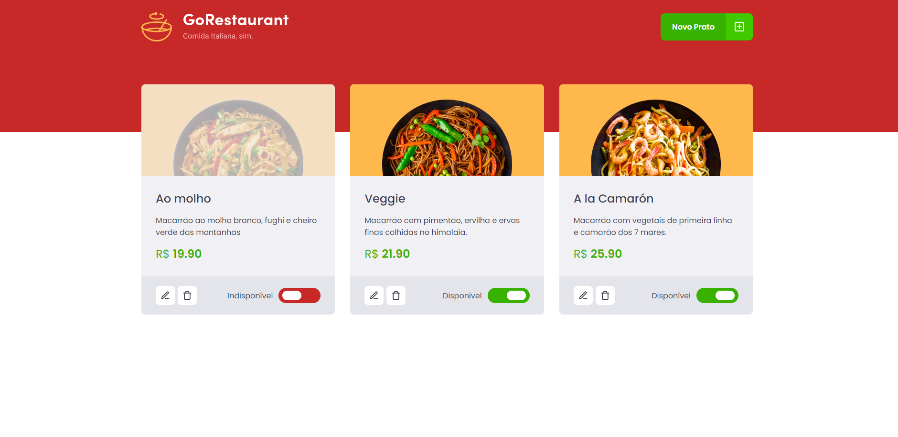

<div align="center">
  
</div>

<h1 align="center"> RocketSeat 🔥 Ignite ReactJS </h1>

<h2 align="center"> challenge 02 : Componentizing the Application ( Project WatchMe ) </h2>

<p align="center">
  <a href="https://rocketseat.com.br">
    
</p>

## 🚀 About Project
In this challenge, the objective was to migrate an application from Javascript and Class Components to Typescript and Function Components. 

## 💻 Project Image

<div align="center">
    
   </br>
</div>

## 🧰 Technologies
This project was developed with the following technologies:
* Typescript
* ReacJS
* Unform
* Styled Components
* Json Server

## ⚙️ Installation
```bash
# You need to install Node.js and Yarn first, then in order to clone the project via HTTPS, run this command:
$ https://github.com/LeonardoMarquesDias/GoRestaurant-Web-ReactJS.git
# or use the download option.

# Install dependencies
$ yarn install
or
$ npm install

# Run the following command to start the fake API with JSON Server to simulate an API that has foods information:
$ yarn server
or
$ npm server

# Run the following command to start the application in a development environment:
$ yarn dev 
or
$ npm dev

# Acesse http://localhost:8080 no seu navagador
```
## 🌐 Reference

[Desafio 02 - WatchMe](https://www.notion.so/Desafio-02-Componentizando-a-aplica-o-b9f0f025c95b437699d0c3115f55b0f1) - Notion Info.


## 📝 License

This project is licensed under the MIT License - see the LICENSE file for details.

---

[Leonardo Dias](https://github.com/LeonardoMarquesDias) 😎


